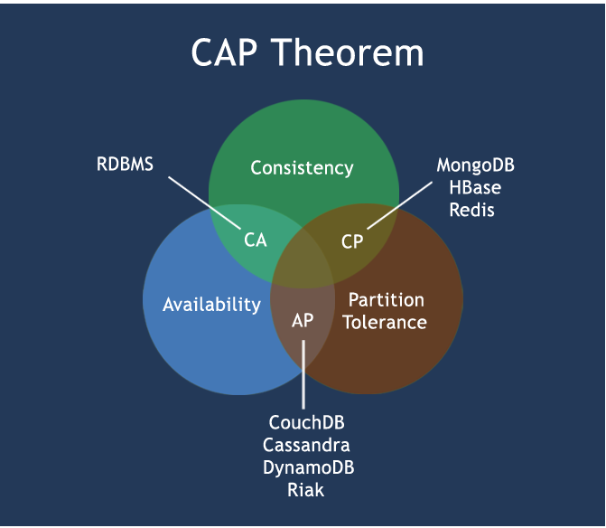
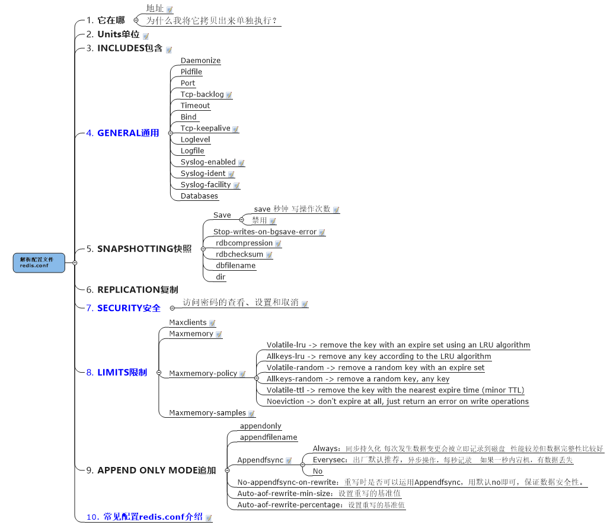

# NoSQL之Redis

## NoSql入门和概述

### 什么是NoSQL

NoSQL(NoSQL = Not Only SQL )，意即“不仅仅是SQL”，泛指非关系型的数据库。随着互联web2.0网站的兴起，传统的关系数据库在应付web2.0网站，特别是超大规模和高并发的SNS类型的web2.0纯动态网站已经显得力不从心，暴露了很多难以克服的问题，而非关系型的数据库则由于其本身的特点得到了非常迅速的发展。NoSQL数据库的产生就是为了解决大规模数据集合多重数据种类带来的挑战，尤其是大数据应用难题，包括超大规模数据的存储。

### NoSQL数据库能干吗

- 易扩展

  NoSQL数据库种类繁多，但是一个共同的特点都是去掉关系数据库的关系型特性。数据之间无关系，这样就非常容易扩展。也无形之间，在架构的层面上带来了可扩展的能力。

- 高性能

  NoSQL数据库都具有非常高的读写性能，尤其在大数据量下，同样表现优秀。这得益于它的无关系性，数据库的结构简单。

- 多样灵活的数据模型

  NoSQL无需事先为要存储的数据建立字段，随时可以存储自定义的数据格式。而在关系数据库里，增删字段是一件非常麻烦的事情。如果是非常大数据量的表，增加字段简直就是一个噩梦

### 传统RDBMS VS NOSQL

RDBMS
- 高度组织化结构化数据
- 结构化查询语言（SQL）
- 数据和关系都存储在单独的表中。
- 数据操纵语言，数据定义语言
- 严格的一致性
- 基础事务

NoSQL
- 代表着不仅仅是SQL
- 没有声明性查询语言
- 没有预定义的模式
- 键 - 值对存储，列存储，文档存储，图形数据库
- 最终一致性，而非ACID属性
- 非结构化和不可预知的数据
- CAP定理
- 高性能，高可用性和可伸缩性

### NoSQL数据模型简介

聚合模型

- KV键值
- Bson
- 列族
- 图形

### NoSQL数据库的四大分类

- **KV键值**

  - 新浪：BerkeleyDB+redis
  - 美团：redis+tair
  - 阿里、百度：memcache+redis

- **文档型数据库(bson格式比较多)**

  - CouchDB

  - MongoDB

    > MongoDB 是一个基于分布式文件存储的数据库。由 C++ 语言编写。旨在为 WEB 应用提供可扩展的高性能数据存储解决方案。MongoDB 是一个介于关系数据库和非关系数据库之间的产品，是非关系数据库当中功能最丰富，最像关系数据库的。

- **列存储数据库**

  - Cassandra, HBase
  - 分布式文件系统

- **图关系数据库**

  >社交网络，推荐系统等。专注于构建关系图谱

  - Neo4J
  - InfoGrid

四者对比


### 在分布式数据库中CAP原理CAP+BASE

**传统的ACID**

- A (Atomicity) 原子性
- C (Consistency) 一致性
- I (Isolation) 独立性
- D (Durability) 持久性

**CAP**

- C:Consistency（强一致性）
- A:Availability（可用性）
- P:Partition tolerance（分区容错性）

#### CAP理论

CAP理论的核心是：一个分布式系统不可能同时很好的满足一致性，可用性和分区容错性这三个需求，
最多只能同时较好的满足两个。
因此，根据 CAP 原理将 NoSQL 数据库分成了满足 CA 原则、满足 CP 原则和满足 AP 原则三 大类：
CA - 单点集群，满足一致性，可用性的系统，通常在可扩展性上不太强大。

> 传统Oracle数据库

CP - 满足一致性，分区容忍必的系统，通常性能不是特别高。

> Redis、Mongodb

AP - 满足可用性，分区容忍性的系统，通常可能对一致性要求低一些。

> 大多数网站架构的选择

注意：分布式架构的时候必须做出取舍。
一致性和可用性之间取一个平衡。多余大多数web应用，其实并不需要强一致性。
因此牺牲C换取A，这是目前分布式数据库产品的方向




#### BASE

- 基本可用（Basically Available）
- 软状态（Soft state）
- 最终一致（Eventually consistent）

> BASE就是为了解决关系数据库强一致性引起的问题而引起的可用性降低而提出的解决方案。它的思想是通过让系统放松对某一时刻数据一致性的要求来换取系统整体伸缩性和性能上改观。为什么这么说呢，缘由就在于大型系统往往由于地域分布和极高性能的要求，不可能采用分布式事务来完成这些指标，要想获得这些指标，我们必须采用另外一种方式来完成，这里BASE就是解决这个问题的办法

#### **分布式+集群**

**分布式系统（distributed system）**

由多台计算机和通信的软件组件通过计算机网络连接（本地网络或广域网）组成。分布式系统是建立在网络之上的软件系统。正是因为软件的特性，所以分布式系统具有高度的内聚性和透明性。因此，网络和分布式系统之间的区别更多的在于高层软件（特别是操作系统），而不是硬件。分布式系统可以应用在在不同的平台上如：Pc、工作站、局域网和广域网上等。

- 分布式

> 不同的多台服务器上面部署不同的服务模块（工程），他们之间通过Rpc/Rmi之间通信和调用，对外提供服务和组内协作。

- 集群

> 不同的多台服务器上面部署相同的服务模块，通过分布式调度软件进行统一的调度，对外提供服务和访问。

## Redis入门

> [Reids官网](http://redis.io/)
>
> [Redis中文网](http://www.redis.cn/)
>
> [操作命令](http://redisdoc.com/)
>
> [Redis脑图](Redis2016.1.4.mmap)

### Redis简介

REmote DIctionary Server(远程字典服务器)

> 是完全开源免费的，用C语言编写的，遵守BSD协议，是一个高性能的(key/value)分布式内存数据库，基于内存运行并支持持久化的NoSQL数据库，是当前最热门的NoSql数据库之一,也被人们称为数据结构服务器

#### 特点

- 支持数据的持久化
- 丰富的数据类型
- master-slave模式的数据备份

#### 作用

- 高性能
- 高并发

#### 用途

- 取最新N个数据的操作，如：可以将最新的10条评论的ID放在Redis的List集合里面

- 模拟类似于HttpSession这种需要设定过期时间的功能

- 发布、订阅消息系统

- 定时器、计数器

- 缓存（数据查询、短连接、新闻内容、商品内容等等）。（最多使用）

- 分布式集群架构中的session分离。
- 聊天室的在线好友列表。
- 任务队列。（秒杀、抢购、12306等等）
- 应用排行榜。
- 网站访问统计。
-  数据过期处理（可以精确到毫秒）

### Redis安装配置

1. 下载

   ```shell
   cd /usr/local
   wget http://download.redis.io/releases/redis-xxx.tar.gz
   ```

2. 解压

   ```shell
   tar -zxvf redis-xxx.tar.gz
   ```

3. 安装gcc（无则安装）

   ```shell
   yum install gcc-c++
   ```

4. 编译（需要gcc依赖）

   ```shell
   cd redis-xxx
   make distclean
   make
   ```

5. 安装

   ```shell
   make install
   ```

6. 安装目录结构

   ```shell
   cd /usr/local/bin
   ```

   - **redis-benchmark** 性能测试工具，服务启动起来后执行
   - **redis-check-aof** AOF文件修复工具，修复有问题的AOF文件
   - **redis-check-rdb** RDB文件修复工具
   - **redis-cli** 客户端，操作入口
   - **redis-sentinel** redis集群管理工具
   - **redis-server** redis服务器启动命令

7. 启动

   ```shell
   redis-server或redis-server --port 6379
   ```

8. 客户端测试

   ```shell
   redis-cli或redis-cli -h 127.0.0.1 -p 6379
   
   redis> set foo bar
   OK
   redis> get foo
   "bar"
   ```

9. 关闭

   ```shell
   单实例关闭：redis-cli shutdown
   多实例关闭，指定端口关闭:redis-cli -p 6379 shutdown
   ```

### 配置文件启动（推荐）

```shell
mkdir /usr/local/etc/redis（同时改变文件夹的权限或拥有者为当前用户，使当前用户能对文件夹进行写入）
cp /usr/local/redis-5.0.5/redis.conf /usr/local/etc/redis/redis.conf
修改redis.conf文件将里面的daemonize no 改成 yes，让服务在后台启动
redis-server /usr/local/etc/redis/redis.conf
```

### Redis五大数据类型

- String（字符串）

> string类型是Redis最基本的数据类型，一个redis中字符串value最多可以是512M

- Hash（哈希，类似java里的Map）

> Redis hash 是一个键值对集合。
> Redis hash是一个string类型的field和value的映射表，hash特别适合用于存储对象。

- List（列表）

> Redis 列表是简单的字符串列表，按照插入顺序排序。你可以添加一个元素导列表的头部（左边）或者尾部（右边）。它的底层实际是个链表

- Set（集合）

> Redis的Set是string类型的无序集合。它是通过HashTable实现实现的，

- Zset(sorted set：有序集合)

> zset 和 set 一样也是string类型元素的集合,且不允许重复的成员。
> 不同的是每个元素都会关联一个double类型的分数。
> redis正是通过分数来为集合中的成员进行从小到大的排序。zset的成员是唯一的,但分数(score)却可以重复。

### 操作命令(简化版)

> [操作命令文档](http://redisdoc.com/) 写的特别清楚

#### Redis 键(key)

- keys *
- exists key的名字，判断某个key是否存在
- move key db   --->当前库就没有了，被移除了
- expire key 秒钟：为给定的key设置过期时间
- ttl key 查看还有多少秒过期，-1表示永不过期，-2表示已过期
- type key 查看你的key是什么类型

#### Redis字符串(String)

- set/get/del/append/strlen
- Incr/decr/incrby/decrby,一定要是数字才能进行加减
- getrange/setrange
- setex(set with expire)键秒值/setnx(set if not exist)
- mset/mget/msetnx
- getset(先get再set)

#### Redis列表(List)

-  lpush/rpush/lrange
-  lpop/rpop
-  lindex，按照索引下标获得元素(从上到下)
-  llen
-  lrem key 删N个value
-  ltrim key 开始index 结束index，截取指定范围的值后再赋值给key
-  rpoplpush 源列表 目的列表
-  lset key index value
-  linsert key  before/after 值1 值2

#### Redis集合(Set)

-  sadd/smembers/sismember
-  scard，获取集合里面的元素个数
-  srem key value 删除集合中元素
-  srandmember key 某个整数(随机出几个数)
-  spop key 随机出栈
-  smove key1 key2 在key1里某个值      作用是将key1里的某个值赋给key2
-  数学集合类
  -   差集：sdiff
  -   交集：sinter
  -   并集：sunion

#### Redis哈希(Hash)

-  hset/hget/hmset/hmget/hgetall/hdel
-  hlen
-  hexists key 在key里面的某个值的key
-  hkeys/hvals
-  hincrby/hincrbyfloat
-  hsetnx

#### Redis有序集合Zset(sorted set)

-  zadd/zrange
-   Withscores
-  zrangebyscore key 开始score 结束score
-  zrem key 某score下对应的value值，作用是删除元素
-  zcard/zcount key score区间/zrank key values值，作用是获得下标值/zscore key 对应值,获得分数
-  zrevrank key values值，作用是逆序获得下标值
-  zrevrange
-  zrevrangebyscore  key 结束score 开始score

### 操作命令(完全版)

> [操作命令文档](http://redisdoc.com/) 写的特别清楚

#### 字符串

- [SET](http://redisdoc.com/string/set.html)
- [SETNX](http://redisdoc.com/string/setnx.html)
- [SETEX](http://redisdoc.com/string/setex.html)
- [PSETEX](http://redisdoc.com/string/psetex.html)
- [GET](http://redisdoc.com/string/get.html)
- [GETSET](http://redisdoc.com/string/getset.html)
- [STRLEN](http://redisdoc.com/string/strlen.html)
- [APPEND](http://redisdoc.com/string/append.html)
- [SETRANGE](http://redisdoc.com/string/setrange.html)
- [GETRANGE](http://redisdoc.com/string/getrange.html)
- [INCR](http://redisdoc.com/string/incr.html)
- [INCRBY](http://redisdoc.com/string/incrby.html)
- [INCRBYFLOAT](http://redisdoc.com/string/incrbyfloat.html)
- [DECR](http://redisdoc.com/string/decr.html)
- [DECRBY](http://redisdoc.com/string/decrby.html)
- [MSET](http://redisdoc.com/string/mset.html)
- [MSETNX](http://redisdoc.com/string/msetnx.html)
- [MGET](http://redisdoc.com/string/mget.html)

#### 哈希表

- [HSET](http://redisdoc.com/hash/hset.html)
- [HSETNX](http://redisdoc.com/hash/hsetnx.html)
- [HGET](http://redisdoc.com/hash/hget.html)
- [HEXISTS](http://redisdoc.com/hash/hexists.html)
- [HDEL](http://redisdoc.com/hash/hdel.html)
- [HLEN](http://redisdoc.com/hash/hlen.html)
- [HSTRLEN](http://redisdoc.com/hash/hstrlen.html)
- [HINCRBY](http://redisdoc.com/hash/hincrby.html)
- [HINCRBYFLOAT](http://redisdoc.com/hash/hincrbyfloat.html)
- [HMSET](http://redisdoc.com/hash/hmset.html)
- [HMGET](http://redisdoc.com/hash/hmget.html)
- [HKEYS](http://redisdoc.com/hash/hkeys.html)
- [HVALS](http://redisdoc.com/hash/hvals.html)
- [HGETALL](http://redisdoc.com/hash/hgetall.html)
- [HSCAN](http://redisdoc.com/hash/hscan.html)

#### 列表

- [LPUSH](http://redisdoc.com/list/lpush.html)
- [LPUSHX](http://redisdoc.com/list/lpushx.html)
- [RPUSH](http://redisdoc.com/list/rpush.html)
- [RPUSHX](http://redisdoc.com/list/rpushx.html)
- [LPOP](http://redisdoc.com/list/lpop.html)
- [RPOP](http://redisdoc.com/list/rpop.html)
- [RPOPLPUSH](http://redisdoc.com/list/rpoplpush.html)
- [LREM](http://redisdoc.com/list/lrem.html)
- [LLEN](http://redisdoc.com/list/llen.html)
- [LINDEX](http://redisdoc.com/list/lindex.html)
- [LINSERT](http://redisdoc.com/list/linsert.html)
- [LSET](http://redisdoc.com/list/lset.html)
- [LRANGE](http://redisdoc.com/list/lrange.html)
- [LTRIM](http://redisdoc.com/list/ltrim.html)
- [BLPOP](http://redisdoc.com/list/blpop.html)
- [BRPOP](http://redisdoc.com/list/brpop.html)
- [BRPOPLPUSH](http://redisdoc.com/list/brpoplpush.html)

#### 集合

- [SADD](http://redisdoc.com/set/sadd.html)
- [SISMEMBER](http://redisdoc.com/set/sismember.html)
- [SPOP](http://redisdoc.com/set/spop.html)
- [SRANDMEMBER](http://redisdoc.com/set/srandmember.html)
- [SREM](http://redisdoc.com/set/srem.html)
- [SMOVE](http://redisdoc.com/set/smove.html)
- [SCARD](http://redisdoc.com/set/scard.html)
- [SMEMBERS](http://redisdoc.com/set/smembers.html)
- [SSCAN](http://redisdoc.com/set/sscan.html)
- [SINTER](http://redisdoc.com/set/sinter.html)
- [SINTERSTORE](http://redisdoc.com/set/sinterstore.html)
- [SUNION](http://redisdoc.com/set/sunion.html)
- [SUNIONSTORE](http://redisdoc.com/set/sunionstore.html)
- [SDIFF](http://redisdoc.com/set/sdiff.html)
- [SDIFFSTORE](http://redisdoc.com/set/sdiffstore.html)

#### 有序集合

- [ZADD](http://redisdoc.com/sorted_set/zadd.html)
- [ZSCORE](http://redisdoc.com/sorted_set/zscore.html)
- [ZINCRBY](http://redisdoc.com/sorted_set/zincrby.html)
- [ZCARD](http://redisdoc.com/sorted_set/zcard.html)
- [ZCOUNT](http://redisdoc.com/sorted_set/zcount.html)
- [ZRANGE](http://redisdoc.com/sorted_set/zrange.html)
- [ZREVRANGE](http://redisdoc.com/sorted_set/zrevrange.html)
- [ZRANGEBYSCORE](http://redisdoc.com/sorted_set/zrangebyscore.html)
- [ZREVRANGEBYSCORE](http://redisdoc.com/sorted_set/zrevrangebyscore.html)
- [ZRANK](http://redisdoc.com/sorted_set/zrank.html)
- [ZREVRANK](http://redisdoc.com/sorted_set/zrevrank.html)
- [ZREM](http://redisdoc.com/sorted_set/zrem.html)
- [ZREMRANGEBYRANK](http://redisdoc.com/sorted_set/zremrangebyrank.html)
- [ZREMRANGEBYSCORE](http://redisdoc.com/sorted_set/zremrangebyscore.html)
- [ZRANGEBYLEX](http://redisdoc.com/sorted_set/zrangebylex.html)
- [ZLEXCOUNT](http://redisdoc.com/sorted_set/zlexcount.html)
- [ZREMRANGEBYLEX](http://redisdoc.com/sorted_set/zremrangebylex.html)
- [ZSCAN](http://redisdoc.com/sorted_set/zscan.html)
- [ZUNIONSTORE](http://redisdoc.com/sorted_set/zunionstore.html)
- [ZINTERSTORE](http://redisdoc.com/sorted_set/zinterstore.html)

#### HyperLogLog

- [PFADD](http://redisdoc.com/hyperloglog/pfadd.html)
- [PFCOUNT](http://redisdoc.com/hyperloglog/pfcount.html)
- [PFMERGE](http://redisdoc.com/hyperloglog/pfmerge.html)

#### 地理位置

- [GEOADD](http://redisdoc.com/geo/geoadd.html)
- [GEOPOS](http://redisdoc.com/geo/geopos.html)
- [GEODIST](http://redisdoc.com/geo/geodist.html)
- [GEORADIUS](http://redisdoc.com/geo/georadius.html)
- [GEORADIUSBYMEMBER](http://redisdoc.com/geo/georadiusbymember.html)
- [GEOHASH](http://redisdoc.com/geo/geohash.html)

#### 位图

- [SETBIT](http://redisdoc.com/bitmap/setbit.html)
- [GETBIT](http://redisdoc.com/bitmap/getbit.html)
- [BITCOUNT](http://redisdoc.com/bitmap/bitcount.html)
- [BITPOS](http://redisdoc.com/bitmap/bitpos.html)
- [BITOP](http://redisdoc.com/bitmap/bitop.html)
- [BITFIELD](http://redisdoc.com/bitmap/bitfield.html)

#### 数据库

- [EXISTS](http://redisdoc.com/database/exists.html)
- [TYPE](http://redisdoc.com/database/type.html)
- [RENAME](http://redisdoc.com/database/rename.html)
- [RENAMENX](http://redisdoc.com/database/renamenx.html)
- [MOVE](http://redisdoc.com/database/move.html)
- [DEL](http://redisdoc.com/database/del.html)
- [RANDOMKEY](http://redisdoc.com/database/randomkey.html)
- [DBSIZE](http://redisdoc.com/database/dbsize.html)
- [KEYS](http://redisdoc.com/database/keys.html)
- [SCAN](http://redisdoc.com/database/scan.html)
- [SORT](http://redisdoc.com/database/sort.html)
- [FLUSHDB](http://redisdoc.com/database/flushdb.html)
- [FLUSHALL](http://redisdoc.com/database/flushall.html)
- [SELECT](http://redisdoc.com/database/select.html)
- [SWAPDB](http://redisdoc.com/database/swapdb.html)

#### 自动过期

- [EXPIRE](http://redisdoc.com/expire/expire.html)
- [EXPIREAT](http://redisdoc.com/expire/expireat.html)
- [TTL](http://redisdoc.com/expire/ttl.html)
- [PERSIST](http://redisdoc.com/expire/persist.html)
- [PEXPIRE](http://redisdoc.com/expire/pexpire.html)
- [PEXPIREAT](http://redisdoc.com/expire/pexpireat.html)
- [PTTL](http://redisdoc.com/expire/pttl.html)

#### 事务

- [MULTI](http://redisdoc.com/transaction/multi.html)
- [EXEC](http://redisdoc.com/transaction/exec.html)
- [DISCARD](http://redisdoc.com/transaction/discard.html)
- [WATCH](http://redisdoc.com/transaction/watch.html)
- [UNWATCH](http://redisdoc.com/transaction/unwatch.html)

#### Lua 脚本

- [EVAL](http://redisdoc.com/script/eval.html)
- [EVALSHA](http://redisdoc.com/script/evalsha.html)
- [SCRIPT_LOAD](http://redisdoc.com/script/script_load.html)
- [SCRIPT_EXISTS](http://redisdoc.com/script/script_exists.html)
- [SCRIPT_FLUSH](http://redisdoc.com/script/script_flush.html)
- [SCRIPT_KILL](http://redisdoc.com/script/script_kill.html)

#### 持久化

- [SAVE](http://redisdoc.com/persistence/save.html)
- [BGSAVE](http://redisdoc.com/persistence/bgsave.html)
- [BGREWRITEAOF](http://redisdoc.com/persistence/bgrewriteaof.html)
- [LASTSAVE](http://redisdoc.com/persistence/lastsave.html)

#### 发布与订阅

- [PUBLISH](http://redisdoc.com/pubsub/publish.html)
- [SUBSCRIBE](http://redisdoc.com/pubsub/subscribe.html)
- [PSUBSCRIBE](http://redisdoc.com/pubsub/psubscribe.html)
- [UNSUBSCRIBE](http://redisdoc.com/pubsub/unsubscribe.html)
- [PUNSUBSCRIBE](http://redisdoc.com/pubsub/punsubscribe.html)
- [PUBSUB](http://redisdoc.com/pubsub/pubsub.html)

#### 复制

- [SLAVEOF](http://redisdoc.com/replication/slaveof.html)
- [ROLE](http://redisdoc.com/replication/role.html)

#### 客户端与服务器

- [AUTH](http://redisdoc.com/client_and_server/auth.html)
- [QUIT](http://redisdoc.com/client_and_server/quit.html)
- [INFO](http://redisdoc.com/client_and_server/info.html)
- [SHUTDOWN](http://redisdoc.com/client_and_server/shutdown.html)
- [TIME](http://redisdoc.com/client_and_server/time.html)
- [CLIENT_GETNAME](http://redisdoc.com/client_and_server/client_getname.html)
- [CLIENT_KILL](http://redisdoc.com/client_and_server/client_kill.html)
- [CLIENT_LIST](http://redisdoc.com/client_and_server/client_list.html)
- [CLIENT_SETNAME](http://redisdoc.com/client_and_server/client_setname.html)

#### 配置选项

- [CONFIG_SET](http://redisdoc.com/configure/config_set.html)
- [CONFIG_GET](http://redisdoc.com/configure/config_get.html)
- [CONFIG_RESETSTAT](http://redisdoc.com/configure/config_resetstat.html)
- [CONFIG_REWRITE](http://redisdoc.com/configure/config_rewrite.html)

#### 调试

- [PING](http://redisdoc.com/debug/ping.html)
- [ECHO](http://redisdoc.com/debug/echo.html)
- [OBJECT](http://redisdoc.com/debug/object.html)
- [SLOWLOG](http://redisdoc.com/debug/slowlog.html)
- [MONITOR](http://redisdoc.com/debug/monitor.html)
- [DEBUG_OBJECT](http://redisdoc.com/debug/debug_object.html)
- [DEBUG_SEGFAULT](http://redisdoc.com/debug/debug_segfault.html)

#### 内部命令

- [MIGRATE](http://redisdoc.com/internal/migrate.html)
- [DUMP](http://redisdoc.com/internal/dump.html)
- [RESTORE](http://redisdoc.com/internal/restore.html)
- [SYNC](http://redisdoc.com/internal/sync.html)
- [PSYNC](http://redisdoc.com/internal/psync.html)

#### 功能文档

- [Redis 集群规范](http://redisdoc.com/topic/cluster-spec.html)
- [持久化（persistence）](http://redisdoc.com/topic/persistence.html)
- [发布与订阅（pub/sub）](http://redisdoc.com/topic/pubsub.html)
- [Sentinel](http://redisdoc.com/topic/sentinel.html)
- [集群教程](http://redisdoc.com/topic/cluster-tutorial.html)
- [键空间通知（keyspace notification）](http://redisdoc.com/topic/notification.html)
- [通信协议（protocol）](http://redisdoc.com/topic/protocol.html)
- [复制（Replication）](http://redisdoc.com/topic/replication.html)
- [事务（transaction）](http://redisdoc.com/topic/transaction.html)

### 解析配置文件redis.conf

